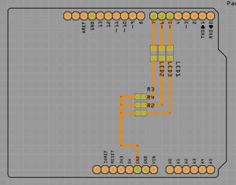

# PCB Machining

> How to machine PCBs like a pro!

I initially preformed these steps using a wifi enabled Handibot. Since then I have acquired a [Nomad 883 Pro](https://shop.carbide3d.com/products/nomad883?variant=1257580459). The Handibot steps can be found in the [handibot branch](https://github.com/Tim-Jackins/pcb-machining/blob/handibot/README.md).

## Parts

Name | Use | Buy
--- | --- | ---
0.9mm PCB Drill Bit | For drilling holes in the copper clad board for normal sized components. | [*](https://www.amazon.com/10pcs-0-9mm-Spiral-Tungsten-Carbide/dp/B00PZYCUAO)
1.5mm PCB End Mill | For milling off any extra copper. | [*](https://www.amazon.com/JIUWU-Carbide-Milling-Cutter-Machine/dp/B00SMDPF4I/ref=sr_1_1?s=industrial&ie=UTF8&qid=1540234929&sr=1-1&keywords=1.5mm+Carbide+End+Milling+Cutter+PCB+Machine+10-pack)
0.1mm PCB Engraving Bit | Used to engrave circuit paths. | [*](https://www.amazon.com/dp/B07D4F5MKD/ref=twister_B07D4FTMC4?_encoding=UTF8&psc=1)
Copper Clad Boards (large) | This is what we are going to carve up to make circuit boards! | [*](https://www.sparkfun.com/products/14976)
Copper Clad Boards (small) | This is what we are going to carve up to make *smaller* circuit boards. | [*](https://www.sparkfun.com/products/14976)
Double Sided tape | This will hold the pcb still after it's cut out of the copper clad board. | [*](https://www.amazon.com/One-Roll-Double-Sided-Carpet-Tape/dp/B002UV6Q0A)

## Fritzing

Let's start by making our sketch in Fritzing. For example, I'm going to make an incredibly simple three LED circuit with an Arduino Uno.


Once you've finished your sketch, lets click on the PCB tab on the top menu in Fritzing. Your breadboard sketch will be converted into a PCB sketch with dotted "Ratsnest" lines instead of wires.


First let's make sure we are working with the right size PCB. Click on the gray transparent rectangle and check that the width and height of the rectangle is correct. You change in the menu in the lower left corner (*hint: if you're using the copper clad boards linked above, you're rectangles dimensions should be 152.4mm x 101.6mm (for large) or 76.2mm x 50.8mm (for small)*).

Now let's turn all your breadboard components into surface mount components. Click on one of your resistors, click the package dropdown menu, and select the appropriate component. For this example my LEDS are `1206 [SMD]` and my resistors are `0805 [SMD]`


From here you should move your components around until they are in optimal positions and then right click the ratsnest wires to create traces. If two ratsnest lines intersect don't be afraid to delete them and make your own lines. The ratsnest feature is helpful but it's finnicky and can over complicated your sketch.

Before you move on to the next step you need to make sure that your sketch is ok by:

- Making sure you're components will fit nicely on your board. Consider adding padding so your components aren't right on the edge of the PCB
- Make sure your wire and pads don't overlap. **Check this multiple times before moving on.**
- Make sure all your components are on the top of the PCB. (*hint: components are bright tan while components on the bottom are weirdly orange.*)
- If they are multi-colored you may have components on the top and bottom of your PCB. You want all of your components to be on one side.
- Picking up your Arduino Uno and thinking "Hmm, this board is going to be acting like a [shield](https://www.adafruit.com/category/21). Let me take a second to visualize what that will look like, how it will attach, and how I need to flip components on Fritzing to make it work."

<details>
<summary>My visualization looks something like this</summary>
<p>

Arduino "Shield"<br><br>


</p>
</details>
<br>

Mine actually looks like this:



Once you finish the PCB sketch in fritzing you need to export it For Extended Gerber.


Save these files in the same directory as your fritzing part but in separate folder named `<Part Name> GERBER`. After storing them you should delete all gerber files you don't need. The only files you need are shown below:

```bash
<Project Name>
├── <Part Name>.fzz
└── <Part Name> GERBER
    ├── <Part Name>_copperTop.gtl
    ├── <Part Name>_drill.txt
    └── <Part Name>_copperBottom.gtl
```

## Carbide Copper

Next, you're going to turn your gerber files into G-Code with a handy webapp called [Carbide Copper](http://copper.carbide3d.com/).

It's pretty clear cut but here are some helpful things to remember:

### Material Setup

- Set **Units** to **MM**.
- The dimensions of your copper plate correctly. Your **X** and **Y**  measurements are going to be the same as your fritzing PCB rectangle and your **Z** value will be 1.58s.
- Set **Job type** accordingly.

### Copper Layer

- For **Gerber_RS247X** select the file labeled `<Part Name>_copperTop.gtl`.
- For **Tool** select #502.
- Your **Isolation Passes** should be at least 5. This makes soldering easier and the [rubout](#Board Routing) faster.

### Drill Holes

- Your **Excellon drill file is:** `<Part Name>_drill.txt`.
- Your **Position** should be the **Same as signal layer**.
- For **Drilling** you should use #609 and set the plunge rate to 360.

At this point you can click **Next** three times and skip to the [last part](#generate_and_save_to_disk). The following instructions should be followed if you want to create a rubout for your board.

### Board Routing

You don't need to do this but you are going to set it up for the following reasons: you want your CNC to mill out the extra copper that you won't be needing. It makes your board look cleaner and soldering components easier.

Routing:

- Check the box marked **Generate outline cut**.
- Set the offsets, width, and height to fit *tightly* around your sketch.
- For **Tool** select #112 .
- Select **Generate Area Rubout**.
- Use the same tool.

### Generate and Save to Disk

Check out your PCB and do that visualization again: "Nice! I'm going these components here and those components there and It'll fit right onto my board... Or will it" Once you're satisfied, click the big button and save it as `copper.nc` in your project folder.

The final copy of the sample board looks like this


## Nomad

### Vocab

Let's learn some vocab!

This is a **waste board**!


This is the mechanism, the **head** that will hold your bit!


Composed of:

1. A **collet** (for holding the 1/8" bits)
2. A **collet nut** (for tightening the collet around the bit)
3. A **bit**! (the thing that's going to do all the copper cutting)

The threaded thing the collet nut is screwed onto is called the **spindle** and the stuff that you're cutting with the machine (in our case copper clad boards) is called **stock**.

### Safety

All of our bits are composed of a material called tungsten carbide. The pro of these bits is that they are quite hard and have a long life (if used properly). The negative is that they are brittle and if misused will [shatter](https://www.youtube.com/watch?v=1o8hIOv9H-w). **Please wear safety googles and have the protective shield down whenever you mill anything.**

### Bits

You'll make your pcb with three bits. (left to right) an engraving bit, drill bit, and an end mill bit.


### Loading Stock

Grab a piece of stock (in this case a one sided copper clad board) and put double sided tape on the side without copper.


And firmly press the stock into the center of the wasteboard.


### Loading a bit

To load a bit first loosen the head by grabbing the two hex wrenches from the caddy and place the black handled one the top of the spindle and the red handled one on the collet nut. Like so:


Put the engraving bit into the collet and tighten the head down.

## Carbide Motion

### Init

Turn the Nomad on and load **Carbide Motion** on the computer. When it loads click on **CONNECT TO CUTTER**. Once connected, click on **LOAD NEW FILE** and select the `copper.nc` file we got from Carbide Copper. Once the file is loaded, select **Jog** from the top right menu and click **INITIALIZE MACHING** to begin the homing cycle. When it asks to measure tool length click **CONTINUE** because we already loaded a bit!

### Zeroing

Once Carbide Motion presents you will the **Jog / Position** controls you should first click **RAPID POSITION** at the bottom and then select **SW**. Then click **DONE**, increase the increment to 1mm and move the bit to the lower left corner of the CNC. **Be very careful approaching the stock with Z-.** It's very easy to break the engraving bit. Try to move it into position with an increment of 1mm or .1mm but when you're very close to the stock use an increment of .01mm and test contact (by sliding paper between the stock and the bit) on every **Z** change. When the paper stops you know you've made contact! Once you've made contact click the **SET ZERO** button followed by the **ZERO ALL** button to properly set the dimension of your pcb board. 

### Running

After that, click **DONE** twice to go back to the **Job Info** screen. Double check that the right has been inputted and then click **RUN** in the upper menu. Close the protective shield and click **START**.

Your PCB is now being milled by the Nomad 833 but there's still more to do... Your nc file is composed of three jobs contour, drill, and rubout. At the beginning of each job the CNC will ask if you have the right bit loaded. #502 is the engraving bit, #609 is your drill bit, and #112 is the end mill bit.

It should run smoothly but in case there's an error you can always press the **PAUSE**.

Things to watch for:

- Any bit engraving bit going too low.
- *More coming soon*

## Soldering

***Coming soon***
