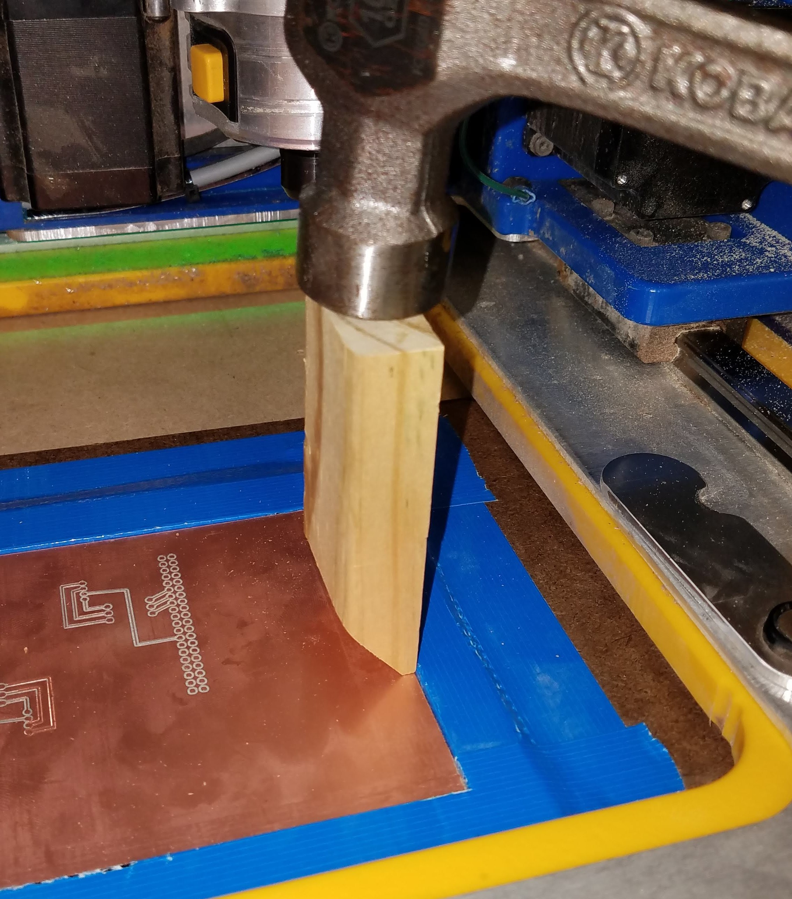

# PCB Machining

> How to machine PCBs

I preformed these steps using a wifi enabled Handibot; however, it should work with any CNC. This guide is specifically for CHS students but the fritzing and carbide copper instructions universal.

## Parts

Name | Use | Buy
--- | --- | ---
0.9mm PCB Drill Bit | Used for drilling holes in the copper clad board for normal sized components. | [*](https://www.amazon.com/10pcs-0-9mm-Spiral-Tungsten-Carbide/dp/B00PZYCUAO)
1.5mm PCB End Mill | Used for milling off any extra copper. | [*](https://www.amazon.com/JIUWU-Carbide-Milling-Cutter-Machine/dp/B00SMDPF4I/ref=sr_1_1?s=industrial&ie=UTF8&qid=1540234929&sr=1-1&keywords=1.5mm+Carbide+End+Milling+Cutter+PCB+Machine+10-pack)
0.1mm PCB Engraving Bit | Used to engrave circuit paths. | [*](https://www.amazon.com/dp/B07D4F5MKD/ref=twister_B07D4FTMC4?_encoding=UTF8&psc=1)
6in x 4in Copper Clad Boards | This is what we are going to carve up to make circuit boards! | [*](https://www.sparkfun.com/products/14976)

## Fritzing

Don't bother using breadboard or schematic mode in fritzing. It's much easier to jump straight into PCB mode. While making your sketch there are some very important rules to follow:

- Click on the gray seethrough rectangle and check that the width and height of the rectangle are correct (101.6 and 152.4 respectively).
- Use only extra thick (48 mil) wires. The CNC is prone to errors so it's good to have some wiggle room. To change wire thickness click on a wire and change the width to `extra thick (48 mil)`
- Make sure your wire and pads don't overlap
- When you're making a shield for the raspberry pi zero **DO NOT USE THE RASPBERRY PI ZERO FRIZTING PART**! The pin headers are smaller than the actual pins on the Raspberry Pi Zero. Use the Raspberry Pi 3 instead.
- Try to place your circuit in the center of the gray rectangle with 8-12 mm of room on each side of the circuit.

Mine looks like this:


Once you finish the PCB sketch in fritzing you need to export it For Extended Gerber.


Save these files in the same directory as your fritzing part but in separate folder named `<Part Name> GERBER`. After storing them you should delete all gerber files you don't need. The only files you need are shown below:

```bash
<Project Name>
├── <Part Name>.fzz
└── <Part Name> GERBER
    ├── <Part Name>_copperTop.gtl
    └── <Part Name>_drill.txt
```

## Carbide Copper

Next up you're going to turn your gerber files into G-Code with a handy webapp called [Carbide Copper](http://copper.carbide3d.com/).

The insructions should be fairly self explanitory but here are some things to remember:

### Material Setup

- Set **Units** to **MM**.
- The dimensions of your copper plate correctly. If you're using [these plates](https://www.sparkfun.com/products/14976) than your measurements (X, Y, Z) are going to be 152.4, 101.6, and 1.58 respectively.
- Set **Job type** to Top Side Only.

Your panel should look like this:


### Copper Layer

- For **Gerber_RS247X** select the file labeled `<Part Name>_copperTop.gtl`.
- For **Tool** I typically pick an engraving size one larger than the bit I'm using just to make sure that my paths are thick enough.
- I would use at least 5 isolation passes. This makes soldering easier and the optional rubout more accurate.


### Drill Holes

- Your **Excellon drill file is:** `<Part Name>_drill.txt`.
- Your **Position** should be the **Same as signal layer**.
- For **Drilling** you should use the the largest bit 0.9mm and set the plunge rate to 360.


At this point you can click **Next** three times and skip to the [last part](#generate_and_save_to_disk). The following instructions should be followed if you want to create a rubout for your board.

### Board Routing / Area Rubout (OPTIONAL)

You don't need to do this but if you want your CNC to mill out all the extra copper that you won't be needing. This makes your board look cleaner and soldering components easier.

Routing:

- Check the box marked **Generate outline cut**.
- Set the offsets, width, and height to fit tightly around your sketch.
- Make sure you're using the 1.587mm tool.

Rubout:

- Select **Generate Area Rubout**.
- Use the 1.587mm tool.

### Generate and Save to Disk

Click the big button and save it as `copper.nc` in a folder named `<Part Name> NC`.

## Handibot

### File handling

For some reason the Handibot doesn't recognize the M-Codes for change tool and rotate clockwise. To fix the latter problem you need to go through your `copper.nc` file
and replace every `M03` to `M04`. Be sure not to change the `S10000` pasrt of it. For the first it gets a bit more tricky: in order to switch tools you need to split up `copper.nc` into 3 separate jobs: contour, drill, and rubout. First make 3 files (named `contour.nc`, `drill.nc`, and `rubout.nc`) in the same directory as `copper.nc`. Your folder structure should now look like this:

```bash
<Project Name>
├── <Part Name>.fzz
├── <Part Name> GERBER
|   ├── <Part Name>_copperTop.gtl
|   └── <Part Name>_drill.txt
└── <Part Name> NC
    └── copper.nc
```

Next ensure that the 3 separate files will have all the right headers and enders. A blank file with these looks like this:

```gcode
( Generated by Carbide Copper )
( Material Size )
( X= 152.400, Y= 101.600, Z= 1.580 )
()
G17
G21
G54
G90
M05

<Code goes here>

M30
%
```

Each job starts with something like this:

```gcode
(  )
T*** M06
( <Name of job> )
```

and ends with `M05`.

Once filled in your file should look something like this:

```gcode
( Generated by Carbide Copper )
( Material Size )
( X= 152.400, Y= 101.600, Z= 1.580 )
()
G17
G21
G54
G90
M05
(  )
T609 M06
( <Name of job> )
M04 S10000

All this jobs coordinates...

M05
M30
%
```

Now that all the jobs are split up, open `rubout.nc` and find the start of the section `( Routing )`. It's a short section that looks something like this:

```gcode
rubout coordinates...
( Routing )
M03 S10000
G0  X54.207 Y86.794
G0  Z3.000
G01 F200 Z0
G01 F200 Z-0.790
G01F200X54.207 Y24.207
X105.794 Y24.207
X105.794 Y86.794
X54.207 Y86.794
G0 Z3.000
M03 S10000
G0  X54.207 Y86.794
G0  Z3.000
G01 F200 Z0
G01 F200 Z-1.580
G01F200X54.207 Y24.207
X105.794 Y24.207
X105.794 Y86.794
X54.207 Y86.794
G0 Z3.000
G00 Z3.000
M05
M30
%
```

you're going to delete all the lines starting with `( Routing )` and ending just before `M05`. That's it! You now have 3 clean jobs and your file structure should resemble this:

```bash
<Project Name>
├── <Part Name>.fzz
├── <Part Name> GERBER
|   ├── <Part Name>_copperTop.gtl
|   └── <Part Name>_drill.txt
└── <Part Name> NC
    ├── contour.nc
    ├── copper.nc
    ├── drill.nc
    └── rubout.nc
```

1. Contour, to be performed by your 0.1mm PCB engraving bit.
2. Drill, to be performed by your 0.9mm PCB drill bit.
3. Rubout, 1.5mm PCB end mill

If you're extremely confused please check out [these examples](/sample_NC). If you aren't totally confused but justifiably want to check your work you should go to [this website](https://ncviewer.com/) and open your NC files to check them. Below are photos of the sample NC files contour, drill, and rubout for reference.

<details>
<summary>Contour</summary>
<p>


</p>
</details>

<details>
<summary>Drill</summary>
<p>


</p>
</details>

<details>
<summary>Rubout</summary>
<p>


</p>
</details>

### Milling

Now it's time to actually cut out your board! Turn on the CNC, wait about 2 minutes, and then connect to it via WiFi (It's called BACNCON BOT). Go to the address http://192.168.42.1/ and wait, this step can sometimes take a long time. While your waiting you should remove the 2 front screws on the CNC and take out the routing head.


Then put on the first bit you're going to use, the .1mm contour bit, and tighten it into place. Remember to leave about a half inch of space from the tip of the holder to the base of the bit and to hold the yellow button to prevent the CNC from rotating.


Next we are going to load our copper plate into place. Load the plate by hand and then wedge it in with a hammer and a wooden wedge.



Hopefully by now the CNC has warmed up and you can start the equipment setup for the first job. Reattach the router and try to make it look the same as it did when you removed it. If you need to login use these credentials: (username: admin, password: go2fabmo) go to the app Fire-Up!


and select measure cutter.


Make sure that you remember to clip on the aligator clip connected to the green wire if you don't the drill won't know when to stop and will keep going! Also when you repeat this process with the drill and rubout bit make the clip shank can't accidentally slip down and snap off the bit.


Countinue with the zeroing process and once it's finished move the head to the center of the copper clad board. Next remove the router from the head and lower the head to z=0. Now put the router back in and set the bit right on the copper. This is pretty tricky but it can be made easier with a multi meter and aligator clips. Set the multimeter to measure conductivity, clip one end to the bit and touch the other end to the copper board, and lower the bit until the multimeter beeps but not too low that it damages the bit!


Once your bit is leveled click on the job manager and click submit job to submit your `contour.nc` file.


Then run that job and when it's done repeat the process for the drill job and then the rubout job. In case you forgot, the process is:

- Change bit
- Install copper
- Zero bit (Don't forget the cutter shank!)
- Physically Zero bit
- Submit job
- Run job
- Repeat

After that cut out and solder your brand new pcb!
